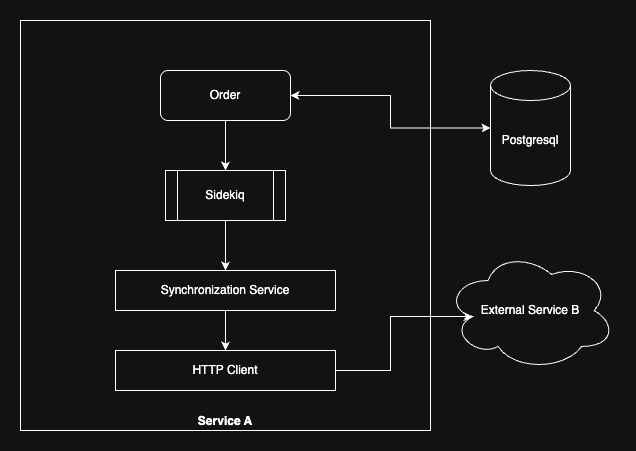

## Record Synchronization Service

This record Synchronization Service will consist of different components that will help build the whole application.

1. **Synchronization Service:** Which will handle syncing based on different actions happen in the Order table.
2. **HTTP Client:** This service will handle the API calling to the external service
3. **Sidekiq:** Background Job processing framework to control the jobs for Order events.
4. **WebMock:** This library is used to stub external services.


### Approach and Design decisions

I want to solve the Synchronization problem with External service with this whole setup. In this approach, I've used the service pattern to define the **Synchronization Services** which is co-ordinating to sync all data changes to external service. I've create Http client to manage htte request handling efficiently. I've used Sidekiq, a well tested library for background jobs processing with controlled way. I've used WebMock to stubbed the API calling to external services.

I've defined the all components in detail as below:

- I've created **Synchronization Services** to manage the API calls to the external service with transformed data based on the record life cycle. i.e. `create`, `update`, `delete`.
  - Transform data before making API call to external service.
  - Please check `app/services/synchronization_service.rb` file for more detail.
- I've created a **Sidekiq** job to manage below stuff:
  - Control the syncing to external services based on `order_id`. So one order processed at a time.
    ```ruby
    # Allow maximum 10 concurrent jobs of this class at a time.
    concurrency: { limit: 10, key_suffix: ->(order_id, action) { order_id } }
    ```
  - Control the job processing by limiting.
    ```ruby
    # Allow maximum 1K jobs being processed within 10 seconds window.
    threshold: { limit: 1_000, period: 10.seconds }
    ```
  - Jobs will be queued and processed in the timely manner.
  - Please check `app/sidekiq/syncing_job.rb` file for more detail.
- I've created **Http client** with `Faraday` to handle the API calls to the external service.
  - It will handle all types of requests: `get`, `post`, `put`, and `delete`
  - It has set up with **retry mechanism** to retry in case of failures.
  - Please check `app/services/http_client.rb` file for more detail.
- Set up the **WebMock** to stub the request to external services
  - Stubbed all types of requests: `get`, `post`, `put`, and `delete`
  - Stubbed dummy response for each type of requests.
  - Please check `config/initializers/webmock.rb` file for more detail.

### System Design

Here is the system design used to build this service. Mentioned component is already discussed above.



### Setup with Docker Compose

You can set up the whole module with Docker Compose which is very easy to use and run the whole application at single command.

This is the initial command to build the application image for different usages mentioned below.

```bash
docker-compose build
```

You can below commands to setup the database and seed the needed data into database.
```bash
# Create development database, run migration, and seed the Orders intothe  database
docker-compose run web bundle exec rake db:create db:migrate db:seed

# We can seed more Orders into the database with the below command. Default 10000 Orders
docker-compose run web bundle exec rake db:seed

# You can customise the input for Orders creation
docker-compose run web bundle exec rake db:seed ORDER_COUNT=10000

# if you want to clean the Orders from database, recreate the Orders in the database
docker-compose run web bundle exec rake db:seed CLEAN_ORDERS='true' 

# You can use both env parameters as below
docker-compose run web bundle exec rake db:seed CLEAN_ORDERS='true' ORDER_COUNT=100
```
Run the whole application at once with web application, sidekiq, PostgreSQL, Redis

```bash
docker-compose up --build
```

Delete the whole setup if not required anymore

```bash
docker-compose down -v
```

